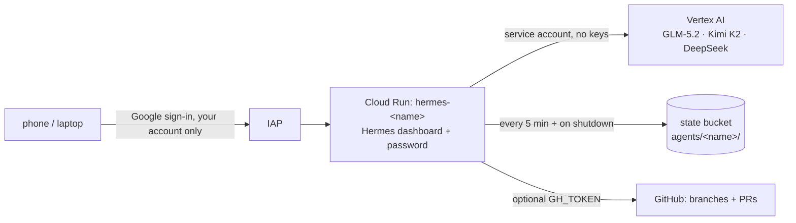

# Hermes agents on Cloud Run

Each agent is a Hermes instance with its own URL, sign-in, saved state and
workspace. Models are the Vertex AI managed open models in your project
(GLM-5.2 by default), billed per token. There are no GPUs to manage.

## Using an agent

Open the URL from `terraform output agent_urls` (or the deploy run's
summary). Sign in with Google, then log in to the dashboard as `admin` with
your dashboard password. An idle agent scales to zero; the first request
afterwards takes about 30 s while it restores its state.

## Adding an agent

Add a line to `infra/gcp-agents/agents.auto.tfvars`, open a PR, merge it, and
approve the `gcp-models` deployment. The new agent appears under
`agent_urls`. Removing a line deletes the service; its saved state stays in
the bucket.

## One-time setup (done for development-drodinvest)

1. `infra/gcp-models/bootstrap.sh`: state bucket, workload identity, deploy
   service account.
2. Apply `infra/gcp-agents` once by hand, then run
   `infra/gcp-agents/bootstrap-agents.sh --project <id>`, which grants the
   deploy service account what CI needs.
3. Run `infra/gcp-agents/set-dashboard-password.sh <project>` in your own
   terminal. It stores only the scrypt hash.
4. **Projects without a Google Cloud organization** (personal accounts): IAP
   needs your own OAuth client, and Google offers no API to create one.
   1. In the Cloud Console, configure the OAuth consent screen: External,
      Testing status, with yourself as a test user.
   2. Create a *Web application* OAuth client.
   3. Run `infra/gcp-agents/set-iap-oauth.sh <project>`.
   4. Add the redirect URI it prints to the client.
5. Optional: to let agents push branches and open PRs, add a fine-grained
   GitHub token scoped to the target repositories (contents and pull requests
   read/write) to the `hermes-agents-github-token` secret. Then set
   `github_token_secret_enabled = true`.

## Limits and costs

| Item | Detail |
|---|---|
| Autonomy | 60 turns per task, loop hard-stop, 5 min per code execution |
| Context | Compression above 64K tokens |
| State | Snapshots every 5 min and on shutdown; work done since the last snapshot can be lost if an instance dies |
| Cost | Cloud Run CPU while an agent is awake (about 15 min after last use), plus Vertex tokens; idle costs nearly nothing |
