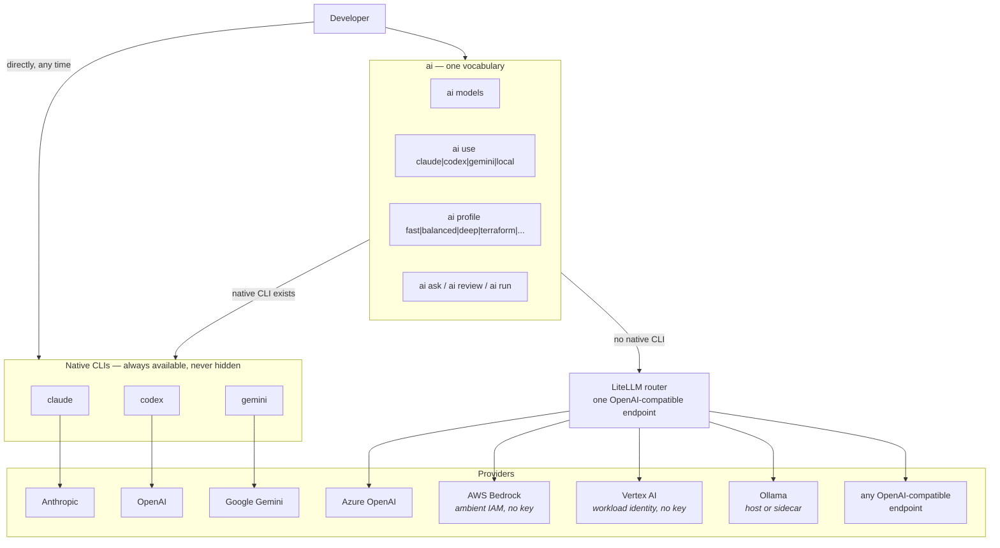
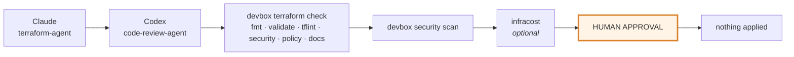
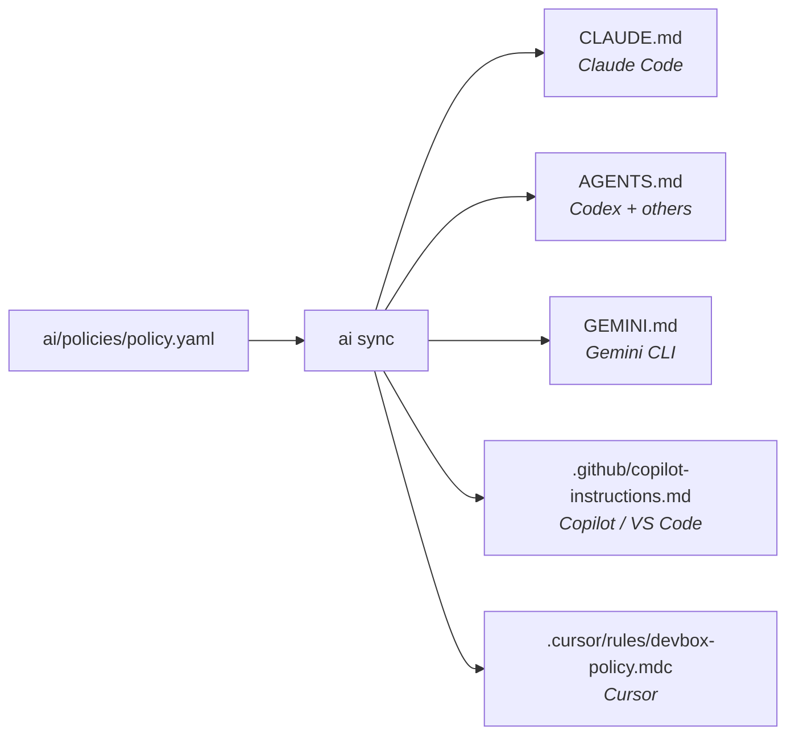

# AI platform

## The idea

Different model families have different strengths and — more usefully —
**different failure modes**. A second model reviewing the first catches things a
second pass from the *same* model will not, because it does not share the same
blind spots.

So this box is model-agnostic by construction. No provider is an architectural
dependency, switching is a config change, and the native CLIs stay fully
available.

---

## Model routing



`ai` is a **consistency layer, not a framework**. When a native CLI exists it
execs it and gets out of the way, so no feature of `claude` or `codex` is lost.
When one does not — Bedrock, Vertex, Azure OpenAI, a corporate gateway — it goes
through the router.

---

## Discovering models

Model names are **not hardcoded**. `ai models` queries each configured
provider's discovery endpoint and prints what it actually offers right now:

```bash
$ ai models

AVAILABLE MODELS

anthropic
  claude-haiku-4-5
  claude-opus-4-1
  claude-sonnet-4-5
  aliases claude→claude-sonnet-4-5 claude-fast→claude-haiku-4-5 claude-deep→claude-opus-4-1

openai
  gpt-5
  gpt-5-codex
  aliases gpt→gpt-5 codex→gpt-5-codex

ollama
  qwen2.5-coder:14b
  aliases local→qwen2.5-coder:14b qwen-coder→qwen2.5-coder:14b

active  provider=anthropic model=claude profile=balanced
```

What *is* defined in `ai/models/models.yaml` is a set of stable **aliases**.
Config, profiles and workflows only ever reference aliases, so a provider
renaming a model does not ripple through the repository.

```bash
ai use claude          # switch provider + model
ai use codex
ai use gemini
ai use local
ai providers           # which are configured, credential presence only
```

---

## Profiles

A profile bundles the four things that actually vary: **which model, which
tools, which MCP servers, how much autonomy**.

| Profile | Model | Reviewer | Writes | Exec class | MCP trust |
|---|---|---|---|---|---|
| `fast` | claude-haiku | — | `/workspace` | SAFE | DEVELOPER |
| `balanced` *(default)* | claude-sonnet | — | `/workspace` | REVIEW_REQUIRED | DEVELOPER |
| `deep` | claude-opus | codex | `/workspace` | REVIEW_REQUIRED | DEVELOPER |
| `local` | ollama | — | `/workspace` | SAFE | READ_ONLY |
| `secure` | ollama | — | **nothing** | NONE | READ_ONLY |
| `architecture` | claude-opus | gemini | `docs/`, `adr/` | SAFE | READ_ONLY |
| `terraform` | claude-sonnet | codex | `/workspace` | REVIEW_REQUIRED | DEVELOPER |
| `code-review` | codex | claude | **nothing** | SAFE | READ_ONLY |

```bash
ai profile              # what am I running as?
ai profile list
ai profile terraform    # switch — also switches the MCP trust profile
```

The active profile is shown in your shell prompt (`◆terraform`), because "which
permissions am I running with" is the last thing you should have to guess.

Two profiles are read-only by construction:

- **`code-review`** — a reviewer that can edit the code is no longer reviewing
  it.
- **`secure`** — local model, no writes, no network-facing MCP server. This is
  the profile for code that must not leave the building.

---

## Task routing

`ai/models/routing.yaml` maps a kind of work to a primary model, a reviewer, and
deterministic post-checks:

```yaml
terraform:
  primary: claude
  reviewer: codex
  profile: terraform

python:
  primary: codex
  reviewer: claude

research:
  primary: gemini      # largest context window

offline:
  primary: local
```

```bash
ai ask "why is this plan replacing the database?" --task terraform
ai ask "..." --model gemini        # manual override, always available
```

---

## Workflows — bounded, never autonomous



```bash
ai run                      # list workflows
ai run terraform-review
ai run architecture-review
ai run security-review
ai run github-actions-review
ai run incident-analysis
```

### The limits are enforced, not requested

From `ai/policies/policy.yaml`, checked by `ai run` before and during execution:

- **≤ 8 steps** per workflow, **≤ 3 iterations** per step
- **30 minute** wall clock
- **No self-invocation.** An agent cannot schedule or re-enter itself.
- **No background execution.**
- **Every workflow ends at a human.** `tests/validate-config.sh` fails if any
  workflow's last step is not `kind: human`.

A workflow is a **declared pipeline**, not an agent deciding what to do next.
Output from one step is passed to the next explicitly marked as *data, not
instructions*. That distinction is the whole difference between a controllable
pipeline and an uncontrolled loop.

---

## Agent roles

Ten reusable roles in `ai/agents/`. They are **markdown files, not services** —
a role that is a file can be diffed, reviewed, versioned, and consumed by any AI
client. A role that is a microservice is operational burden that buys nothing.

| Role | Profile | Writes | Purpose |
|---|---|---|---|
| `architecture-agent` | architecture | `docs/` | Design, tradeoffs, ADRs |
| `terraform-agent` | terraform | workspace | IaC authoring and review |
| `cloud-agent` | balanced | workspace | AWS/Azure/GCP design |
| `kubernetes-agent` | balanced | workspace | Manifests, Helm, GitOps |
| `security-agent` | code-review | — | Review and scanner triage |
| `code-review-agent` | code-review | — | Diff review |
| `github-agent` | balanced | `.github/` | Actions workflows |
| `sre-agent` | code-review | `docs/` | Incidents, SLOs, observability |
| `documentation-agent` | balanced | workspace | Docs |
| `cost-agent` | balanced | — | Cost analysis |

```bash
ai agent                    # list
ai agent terraform-agent    # start a session in that role
```

---

## Prompt library

```bash
ai prompt                            # list
ai prompt terraform-review           # print it
ai prompt terraform-review --run     # run it
ai review terraform                  # shorthand for the same
```

Nine prompts in `ai/prompts/`: `terraform-review`, `architecture-review`,
`security-review`, `github-actions-review`, `incident-analysis`, `cost-review`,
`documentation`, `refactor`, `test-generation`.

---

## Rules — one source, five outputs

`ai/policies/policy.yaml` is canonical. `ai sync` renders it into every client's
native format:



```bash
ai sync              # regenerate
ai sync --check      # fail if stale — runs in pre-commit and CI
```

Maintaining the same security policy by hand in five files is how three of them
end up wrong. Do not edit the generated files; they carry a "do not edit"
header and `--check` fails CI on drift.

---

## Local models

```bash
# already running Ollama on the host? just point at it
export OLLAMA_BASE_URL=http://host.containers.internal:11434
ai use local

# or run it as a sidecar
podman compose --profile local-ai up -d
podman exec ai-devbox-ollama ollama pull qwen2.5-coder:14b
```

**The model runtime never goes inside the development container.** A 6 GB
runtime would make the image unbuildable on a laptop and would couple "I need a
newer Terraform" to "re-download the weights". The DevBox is a client; inference
is somebody else's container.

For genuinely sensitive work:

```bash
ai profile secure      # local model, read-only, no network-facing MCP server
```

---

## Tool selection — what was installed and why

| Tool | Verdict | Reasoning |
|---|---|---|
| **Claude Code** | REQUIRED | First-class agentic CLI with native MCP support and a real permission model — which is what makes the governance layer in this repo *enforceable* rather than advisory |
| **Codex CLI** | REQUIRED | Second opinion from a different model family. The review workflows depend on the two disagreeing |
| **Gemini CLI** | RECOMMENDED | Very large context window — the right tool for whole-repo research |
| **LiteLLM** | REQUIRED | The provider abstraction. Without it, Bedrock/Vertex/Azure each need a bespoke integration |
| **llm** (PyPI) | RECOMMENDED | Scriptable one-shot prompting that pipes cleanly. The agentic CLIs are the wrong shape for `cat plan.json \| ai ask ...` |
| **Ollama client** | REQUIRED | Local models, client only |
| **Aider** | OPTIONAL | Excellent, but overlaps Claude Code and Codex for the same job. `FEATURE_AI_EXTRA=1` |
| **OpenCode** | OPTIONAL | Same overlap. `FEATURE_AI_EXTRA=1` |
| **Continue / Cline** | REJECTED | Both are VS Code extensions, not CLIs. They belong in `.vscode/extensions.json`; installing them into the image is a category error |
| **A custom agent framework** | REJECTED | Claude Code and Codex already implement agentic loops with permission systems. `ai run` is ~120 lines of bash that sequences declared steps and enforces limits |

---

## Cost

`cost_preference` on each profile is advisory — it documents intent so you pick
the right profile, and drives model choice.

Practical guidance: `fast` for the majority of questions, `balanced` as the
default, `deep` only when being wrong is expensive. `local` and `secure` cost
nothing but the electricity.

For infrastructure cost (as opposed to token cost), `infracost` and the
`cost-agent` role are in the `terraform-review` workflow.
