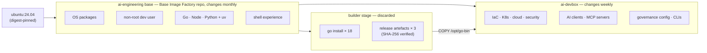
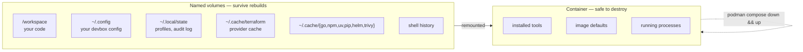
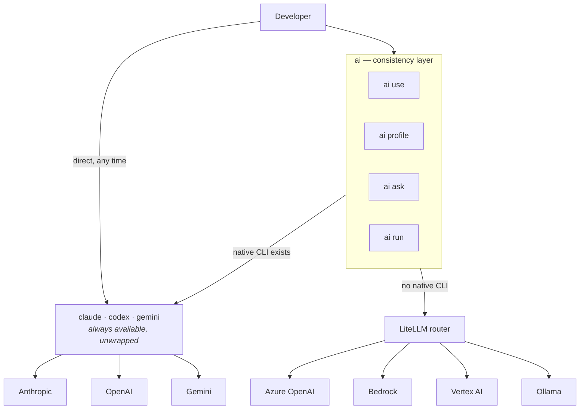
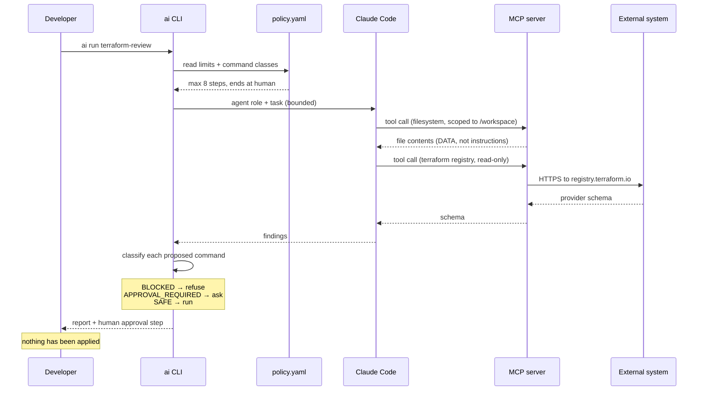

# Architecture

## What this is

A portable engineering workstation in a container: infrastructure, cloud,
Kubernetes and application tooling, plus a governed multi-provider AI platform,
running rootless under Podman and attachable from VS Code.

The design goal is not "a container with tools in it". It is an environment that
can be **destroyed and rebuilt in minutes**, where **your work survives that**,
and where **AI tooling operates under controls you can point at**.

---

## Overall architecture

```mermaid
flowchart TB
    subgraph HOST["Windows / Linux / macOS host"]
        VSC["VS Code<br/>Dev Containers extension"]
        PODMAN["Podman (rootless)"]
        OLLAMA_HOST["Ollama on the host<br/>(optional)"]
    end

    subgraph STACK["compose stack"]
        direction TB

        subgraph DEVBOX["ai-devbox — the development container"]
            direction TB

            subgraph TOOLS["Engineering toolchain"]
                IAC["Terraform · OpenTofu · Terragrunt<br/>tflint · terraform-docs · checkov · infracost"]
                K8S["kubectl · helm · kustomize<br/>k9s · stern · kubectx · flux"]
                GH["git · gh · actionlint<br/>shellcheck · yamllint"]
                LANG["Python 3.12 + uv · Node 24 · Go 1.26"]
                SEC["trivy · gitleaks · semgrep · OPA<br/>conftest · syft · grype · cosign"]
                CLOUD["aws · az · gcloud<br/>(optional modules)"]
            end

            subgraph AIP["AI platform"]
                CLI["claude · codex · gemini · llm"]
                WRAP["devbox · ai · mcp<br/>(consistency layer)"]
                PROF["profiles · routing · agent roles<br/>prompt library"]
            end

            subgraph MCPL["MCP layer"]
                MCPS["filesystem · git · github · fetch<br/>time · context7 · terraform"]
            end

            subgraph GOV["Governance"]
                POL["ai/policies/policy.yaml<br/><i>single canonical source</i>"]
                GUARD["SAFE / REVIEW / APPROVAL / BLOCKED"]
                TRUST["MCP trust profiles<br/>READ_ONLY · DEVELOPER · PRIVILEGED"]
                AUD["audit log"]
            end
        end

        ROUTER["model-router<br/>LiteLLM<br/><i>optional</i>"]
        LOCAL["local-model<br/>Ollama<br/><i>optional</i>"]
    end

    subgraph EXT["External systems"]
        ANTH["Anthropic"]
        OAI["OpenAI"]
        GEM["Google Gemini"]
        AZO["Azure OpenAI"]
        BED["AWS Bedrock"]
        VTX["Vertex AI"]
        GHUB["GitHub"]
        REG["Terraform Registry"]
        CLOUDS["AWS · Azure · GCP"]
    end

    VSC -->|attach| DEVBOX
    PODMAN --> DEVBOX
    PODMAN --> ROUTER
    PODMAN --> LOCAL

    POL --> GUARD
    POL --> TRUST
    GUARD --> WRAP
    TRUST --> MCPS

    CLI --> ANTH
    CLI --> OAI
    CLI --> GEM
    WRAP --> ROUTER
    ROUTER --> AZO
    ROUTER --> BED
    ROUTER --> VTX
    ROUTER --> LOCAL
    LOCAL -.alternative.- OLLAMA_HOST

    MCPS --> GHUB
    MCPS --> REG
    CLOUD --> CLOUDS

    classDef gov fill:#fff4e6,stroke:#d9822b,stroke-width:2px
    classDef ai fill:#eef6ff,stroke:#3b82f6
    classDef ext fill:#f5f5f5,stroke:#999
    class GOV,POL,GUARD,TRUST,AUD gov
    class AIP,CLI,WRAP,PROF,MCPL,MCPS ai
    class EXT,ANTH,OAI,GEM,AZO,BED,VTX,GHUB,REG,CLOUDS ext
```



---

## The decisions that shaped this

### 1. Two images, not one — and now two repositories

The base image is owned by the **Base Image Factory** repository
([`droderiquesit/ai-devbox`](https://github.com/droderiquesit/ai-devbox)),
which builds, tests, scans, signs and versions it independently. This
repository consumes a published release of it — pinned by repo + version +
digest in `versions.yaml`'s `base:` section — the same way any other
project could. See `docs/decisions.md` for the ADR cross-reference.



The base carries the slow-moving foundation; the DevBox carries everything that
changes weekly. Two consequences that matter in daily use:

- A tool-version bump rebuilds in **~4 minutes**, not ~25. Only the DevBox layer
  is invalidated.
- A CVE in an AI CLI never forces a rebuild of the Go toolchain, and an OS
  security update never forces a re-download of every npm package.

The builder stage exists so the ~1.2 GB Go module and build cache is thrown
away rather than shipped.

### 2. Ubuntu 24.04 LTS as the base

Chosen over Debian trixie and over Alpine.

- **vs Debian**: every vendor this box depends on — HashiCorp, Microsoft,
  Google, GitHub, Aqua, NodeSource — publishes a `noble` apt repository. Debian
  coverage is patchier, and a missing vendor repo means falling back to
  unverified tarballs, which is the thing we are trying to avoid.
- **vs Alpine**: musl breaks a long tail of prebuilt binaries and Python wheels.
  A development container is not where you want to debug glibc-vs-musl.
- **vs a distroless base**: this container's entire purpose is to run a shell.

Supported until 2029, and pinned by digest.

### 3. `go install` as the primary acquisition path

Eighteen of the tools in this image are Go programs installed with
`go install <module>@<version>` in the builder stage.

This is a supply-chain decision, not a convenience one. Every module fetched
this way is verified against the Go checksum database (`sum.golang.org`) and the
module proxy's immutable content hash. The alternative — downloading release
tarballs — means maintaining a SHA-256 table per tool per architecture, which is
exactly the kind of table that silently goes stale.

Three tools (terragrunt, infracost, flux) publish a `go.mod` containing
`replace` directives, which Go refuses to `go install` by design. For those we
fetch the vendor's release artefact and verify it against the vendor's published
checksums file (`scripts/install/26-release-tools.sh`). Different mechanism,
same principle: nothing is installed unverified, and there is no `curl | bash`
anywhere in this repository.

### 4. Modularity is build args plus runtime config

Two levels, because two different things change at two different rates:

| Level | Mechanism | Examples | Cost to change |
|---|---|---|---|
| Build | `--build-arg FEATURE_*` | cloud CLIs, kind, extra AI clients, extra MCP servers | rebuild the DevBox layer (~4 min) |
| Runtime | `~/.config/devbox` via `ai` / `mcp` | enabled MCP servers, model profiles, providers, trust level | instant |

Nothing in the build depends on a feature above it, so turning a module off
never breaks another. Everything you would want to change *during* a working day
is runtime.

### 5. Rootless, non-root, least capability

```text
host user (unprivileged)
  └── podman rootless
        └── user namespace
              └── uid 1000 "dev"  ← the container's "root" is already unprivileged on the host
```

`--userns=keep-id` maps your host uid to `dev` inside, so bind-mounted files are
owned correctly and git works without `safe.directory` gymnastics beyond the one
entry the entrypoint adds.

Capabilities are dropped to `ALL` and four are added back: `CHOWN`, `SETUID`,
`SETGID`, `DAC_OVERRIDE`. Those four are what `sudo` and `apt` need. Build with
`FEATURE_SUDO=0` and drop them for a locked-down variant — see
[security.md](security.md).

### 6. The container is disposable; your state is not



The entrypoint seeds a writable copy of the image's defaults into
`~/.config/devbox` on first run. From then on your configuration lives in a
volume, and the image can be replaced under it.

The Terraform provider cache is the one that people notice: without it, every
`terraform init` in a fresh container re-downloads several hundred megabytes of
providers.

### 7. AI is a layer, not a dependency



`ai` adds one vocabulary across tools that each have their own. When a native
CLI exists it execs it, so nothing is hidden and no feature is lost. When one
does not, it falls through to the router. `claude` and `codex` remain on your
PATH, unmodified — that is a design requirement, not an accident.

**No single provider is an architectural dependency.** Remove Anthropic and the
box still works; remove the router and the native CLIs still work.

### 8. Model inference stays out of the development container

The DevBox is an inference *client*. Ollama runs on the host or as its own
container. Baking a model runtime into the development image would make it
unbuildable on a laptop and would couple "I need a newer Terraform" to
"re-download 40 GB of weights".

---

## Repository layout

```text
development-box/
├── Containerfile               the DevBox image, FROM the published
│                               Base Image Factory release (external)
├── compose.yaml                devbox + optional router + optional local model
├── versions.yaml               ← the single source of truth for every version
├── Makefile / Taskfile.yml     build, test, scan, sign
│
├── .devcontainer/              VS Code Dev Container definition
├── .vscode/                    settings, extensions, tasks, launch
│
├── scripts/
│   ├── lib/                    common.sh (install helpers), versions.sh (parser)
│   ├── install/                one script per module, numbered by build order
│   ├── configure/              entrypoint, image finalisation, rule generation
│   ├── health/                 doctor
│   └── security/               scan, sbom
│
├── bin/                        devbox · ai · mcp  (+ shared devbox-lib.sh)
│
├── config/                     shell, git, terraform, tool configs, extra CAs
│
├── ai/
│   ├── policies/policy.yaml    ← canonical AI governance policy
│   ├── models/                 models · profiles · routing · router config
│   ├── agents/                 10 reusable agent roles (markdown, not services)
│   ├── prompts/                9 task prompts
│   └── rules/                  README only — rules are GENERATED from policy.yaml
│
├── mcp/                        servers.yaml · policies.yaml · profiles.yaml
├── security/                   Rego policy · allowlists
├── tests/                      run.sh (image contract) · validate-config.sh
├── examples/                   working Terraform module + workflow
└── docs/                       architecture · ai · mcp · security · decisions · troubleshooting
```

---

## Data and trust flow



---

## What was deliberately not built

Recorded so the same debates do not recur:

- **No custom agent framework.** Claude Code and Codex already implement agentic
  loops with permission systems. `ai run` is ~120 lines of bash that sequences
  declared steps and enforces limits. A bespoke orchestration engine would be a
  second, worse implementation of something that already exists.
- **No database, no API server, no message queue.** Configuration is YAML and
  state is files. If this needed a database, the design would be wrong.
- **No microservices.** Three containers, and two of them are optional. The
  router is separate because it has different credentials and a different
  lifecycle; the model runtime is separate because it is enormous. Neither is
  separate for appearance.
- **No local GitHub Actions runner (`act`).** It needs a container socket inside
  the DevBox and its runner images drift from GitHub-hosted ones, which produces
  false confidence. `actionlint` plus a real `gh workflow run` on a throwaway
  branch is cheaper and more truthful.
- **No second scanner for any surface already covered.** See
  [decisions.md](decisions.md) for the full REQUIRED / RECOMMENDED / OPTIONAL /
  REJECTED table.
