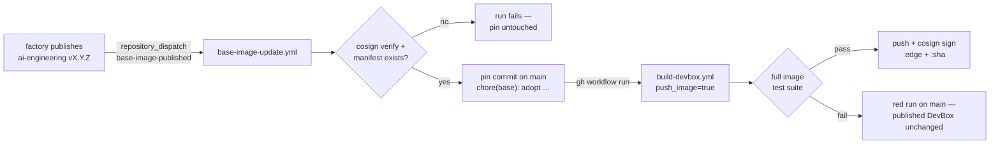

# The automated rebuild chain — DevBox side

The Base Image Factory ([`droderiquesit/ai-devbox`](https://github.com/droderiquesit/ai-devbox))
publishes a release; within a few hours at most (often seconds) a freshly
built, fully tested, signed DevBox sits in the registry on top of it — with no
human in the loop and no step of the existing pipeline skipped. This page
explains the machinery on **this** side of that chain: what fires, what is
verified, what is committed, and what to do when any of it misbehaves.

**No cross-repo credential is required for correctness.** The reconciler
below polls the factory's registry package directly — this repo's own
`GITHUB_TOKEN` already has read access to it (the one-time GHCR grant made
during setup) — and adopts a new release on its own. A `repository_dispatch`
from the factory is accepted too, purely as a latency shortcut, IF the
factory happens to hold a PAT for it; nothing here depends on that PAT
existing.

The design constraint everything below serves: **the pin in `versions.yaml`
stays the single source of truth, and a human-quality audit trail survives the
automation.** The machine writes the same two-line commit a person would have
written, and every other safeguard — the test suite, the signature checks, the
revertability — is the pre-existing one, reused.

## Event flow

Step by step:

1. **Factory publish.** The factory's release workflow pushes and signs
   `ghcr.io/droderiquesit/ai-devbox/ai-engineering:X.Y.Z`, then sends a
   `repository_dispatch` (`event_type: base-image-published`) to this
   repository. The payload names the repository, version, digest, the
   factory's git SHA and the run URL that produced it.
2. **Verification.** `base-image-update.yml` treats that payload as *data,
   not truth*. It refuses payloads for any repository other than the one
   `base.repo` pins, shape-checks version and digest, confirms the manifest
   actually exists, and `cosign verify`s the digest against the factory's
   keyless signing identity (certificate identity
   `https://github.com/droderiquesit/ai-devbox/…`, issuer
   `https://token.actions.githubusercontent.com`). Anyone can send a
   plausible dispatch event; only the factory's own Actions runs can produce
   that signature.
3. **Pin commit.** `base.version` + `base.digest` in `versions.yaml` move to
   the new release, committed to `main` as `github-actions[bot]` with a
   `chore(base): adopt ai-engineering X.Y.Z` message that records the digest,
   the factory SHA and the trigger. Same two lines Renovate or a human would
   change; same one-commit revert.
4. **Full pipeline.** The updater dispatches `build-devbox.yml` with
   `push_image=true`. That workflow pulls the newly pinned digest (hard error
   if it is missing), builds, runs the complete image test suite, produces
   the SBOM, scans — and only *then* pushes and signs.
5. **Publish.** `:edge` and `:sha` tags land, signed, with labels naming the
   exact base they were built on. Cutting a versioned release remains a
   deliberate human act via `release.yml`, exactly as before.

## The reconciler — the primary mechanism, not a backstop

The factory's dispatch is optional and may never fire (no PAT configured
there is the expected default, not a failure). So this same workflow also
runs on a schedule, **every 4 hours** (`15 */4 * * *` UTC): it lists the base
repository's tags, picks the highest `X.Y.Z`, resolves its digest, and walks
the identical verify-adopt-build path used for a dispatch. This is the
guaranteed path a new base image reaches this repository by — the dispatch,
when present, only shortens the wait.

Three properties make this safe to run forever:

* **Idempotent** — pin already current means a `::notice::` and a green exit;
  no commit, no build, no churn. Running it every 4 hours costs one cheap
  registry poll per run when nothing changed.
* **Monotonic** — the reconciler (and the dispatch path) refuse to move the
  pin to a *lower* version. A stale or replayed event for 1.0.1 arriving
  after 1.0.2 was adopted cannot quietly downgrade anything. Only a manual
  `workflow_dispatch` naming an explicit version may go backwards, because a
  rollback is a decision, not a race outcome.
* **Convergent** — whatever was missed (or never sent), the fleet is at most
  one interval — a few hours — behind the newest published base, with or
  without the factory ever holding a dispatch credential.

Renovate's base-image custom manager (see `renovate.json`) stays configured
as the *tertiary* net behind these two: if both the dispatch and the
reconciler fail for a week, a Renovate PR still surfaces the new release.

## Traceability

Every question of the form "what exactly is this DevBox standing on?" has a
recorded answer, three layers deep:

| Question | Where the answer lives |
|---|---|
| Which base digest was this DevBox **built from**? | Image labels `org.opencontainers.image.base.name` + `org.opencontainers.image.base.digest` (stamped from the resolve step's *pulled* digest, not the requested tag); also the build run's summary table |
| Which base was pinned **at any commit**? | `git log -- versions.yaml` — every adoption is one `chore(base):` commit naming version, digest, factory SHA and trigger |
| Which factory build produced that base? | The pin commit's `factory sha:` + run URL trailer, and the factory release notes for `ai-engineering-vX.Y.Z` |
| Which Ubuntu digest is underneath the base? | The factory's release notes / its own `versions.yaml` at that factory SHA — the same pin-file pattern, one level down |

Chain complete: **DevBox image → base digest → factory git SHA → ubuntu
digest**, each hop recorded in either an image label or a git history that
cannot be rewritten without being noticed.

## Failure isolation

The pin commit and the publish are deliberately decoupled: moving the pin
publishes nothing. If the factory ships a broken base:

* `build-devbox.yml` fails in the test suite (or the scan), **before** the
  push step — the previously published DevBox is untouched.
* The failure is loud: a red run on `main`, with `versions.yaml` already
  pointing at the culprit digest. Diagnosis starts from the pin commit, not
  from archaeology.
* Recovery is one `git revert` of the pin commit (plus re-running the build),
  or a manual dispatch with the previous version+digest pair.

If the *updater* itself fails — verification rejects a digest, the registry
is down, the push races a human commit — the pin is simply not moved, and the
next day's reconciliation retries from scratch. There is no half-adopted
state to clean up.

## Manual recovery

Everything the automation does can be driven by hand:

| Situation | Command |
|---|---|
| Adopt a specific factory release | `gh workflow run base-image-update.yml -f base_version=1.0.2 -f base_digest=sha256:…` |
| Adopt whatever is newest, right now | `gh workflow run base-image-update.yml` (both inputs empty = reconcile) |
| Force a rebuild + publish without touching the pin | `gh workflow run build-devbox.yml -f push_image=true` |
| Roll back a bad adoption | `git revert <pin commit>` on a branch + PR, **or** `gh workflow run base-image-update.yml -f base_version=<old> -f base_digest=<old digest>` |

The rollback dispatch is the one path allowed to move the pin to a lower
version — explicit inputs are read as a human decision, and the same cosign
verification still gates them.

## Loop prevention

Automation that commits and dispatches needs an argument for why it
terminates. Here it is:

* **This repository dispatches nothing outward.** The factory sends events
  here; nothing here sends events to the factory (or anywhere else). The
  graph of cross-repository triggers has one edge, pointing in.
* **The pin commit triggers no workflows.** It is pushed with the
  workflow-provided `GITHUB_TOKEN`, and GitHub suppresses workflow runs for
  push events created by that token — precisely to break commit→build→commit
  cycles. That suppression is also *why* the updater must dispatch
  `build-devbox.yml` explicitly (`workflow_dispatch` being one of the event
  types GitHub still honours for `GITHUB_TOKEN`-initiated actions).
* **`build-devbox.yml` commits nothing.** The chain is
  event → pin commit → build → registry, and the registry is a sink.
* **Re-delivery is idempotent.** Any trigger arriving twice hits the
  "already tracks" fast exit; stale triggers hit the downgrade guard. The
  `base-image-update` concurrency group queues (never cancels) overlapping
  runs, so an older adoption finishing late cannot overwrite a newer one.
