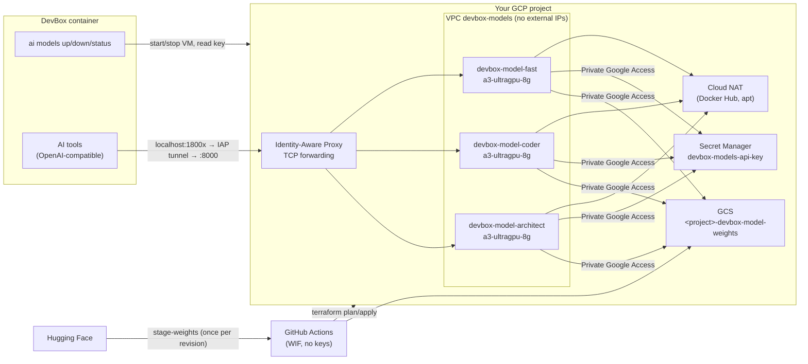

# Self-hosted models on GCP (H200)

The DevBox can use three of the largest open-weight models, each served by
vLLM on its own 8×H200 Compute Engine VM in **your** GCP project. You pay
only for your own compute. A VM is stopped unless someone is using it.

| Key (served name) | Model | Params (active) | Weights | License | DevBox port |
|---|---|---|---|---|---|
| `architect` | [`moonshotai/Kimi-K2.6`](https://huggingface.co/moonshotai/Kimi-K2.6) | 1.03T (32B), INT4 | 596 GB | Modified MIT (`other`); read the card | `localhost:18001` |
| `coder` | [`deepseek-ai/DeepSeek-V4-Pro-0813`](https://huggingface.co/deepseek-ai/DeepSeek-V4-Pro-0813) | 1.6T (49B), FP4+FP8 | 893 GB | MIT | `localhost:18002` |
| `fast` | [`zai-org/GLM-5.3`](https://huggingface.co/zai-org/GLM-5.3) | 743B (39B), FP8 | 756 GB | `other`; read the card | `localhost:18003` |

All three run on `a3-ultragpu-8g`: 8× H200 141 GB (1,128 GB HBM), 224 vCPU,
2,952 GB RAM and 12,000 GiB of local NVMe SSD. **Kimi K3** (2.78T, about
1,560 GB) is left out because its weights do not fit on one node. `fast` is
simply the third large model. The DevBox depends on the key names, so they
stay the same.

`coder` is the official **0813** release of DeepSeek-V4-Pro. The vLLM recipe
describes it as superseding the April preview (`deepseek-ai/DeepSeek-V4-Pro`)
and as much stronger on agentic tasks. To serve the preview instead, change
`hf_repo`/`hf_revision` (see [Swapping a model](#swapping-a-model)).

Everything lives in [`infra/gcp-models/`](../infra/gcp-models) and is deployed
by [`.github/workflows/gcp-models.yml`](../.github/workflows/gcp-models.yml).

## Architecture



When a VM boots, its startup script
([`templates/startup.sh`](../infra/gcp-models/templates/startup.sh)) does the
following:

1. Arms the watchdog.
2. Waits for the NVIDIA driver.
3. Builds a RAID0 array from the 32 local NVMe SSDs and mounts it at
   `/mnt/models`.
4. Runs `gcloud storage rsync` to copy the pinned weights from GCS.
5. Reads the API key from Secret Manager with the metadata-server token.
6. Runs the pinned `vllm/vllm-openai` image on port 8000.

The weights travel over Private Google Access, so the copy has no NAT or
egress charges. Local SSD is wiped on every stop, so the copy runs on every
boot. Expect **about 15–30 minutes from start to first token**: copying
600–900 GB, loading it, then compiling and capturing CUDA graphs. The Docker
image stays cached on the boot disk.

## One-time setup

### 1. Bootstrap the project

Run this yourself, with Owner credentials, once per project. Agents and CI
never run it.

```bash
infra/gcp-models/bootstrap.sh \
  --project YOUR_PROJECT \
  --iap-member user:you@example.com \
  --billing-account XXXXXX-XXXXXX-XXXXXX   # optional: enables the budget
```

The script is idempotent. It does the following:

- Enables the required APIs.
- Creates the private state bucket (versioned, uniform access, public access
  prevention).
- Creates the weights bucket.
- Creates four service accounts (runtime, plan, deploy, stage).
- Creates a Workload Identity Federation pool and provider that accept only
  this repository on `main` or on pull requests.
- Prints the `gh variable set …` commands to run.

Each role it grants is listed and justified in the script. No identity gets
Owner or Editor. The deployer's `projectIamAdmin` is limited by an IAM
condition to granting `logWriter`, `metricWriter` and the `devboxModelsLister`
custom role.

### 2. Create the `gcp-models` GitHub environment

The repository policy requires a human to approve every `terraform apply`.
The `gcp-models` environment is that gate: it covers both apply and weight
staging. To set it up, go to **Settings → Environments → New environment →
`gcp-models`** and do the following:

- Add yourself under **Required reviewers**.
- Under **Deployment branches**, choose *Protected branches only*.

The deploy and stage service accounts accept only tokens whose subject is
`repo:droderiquesit/development-box:environment:gcp-models`.

### 3. Request GPU quota

New projects start with zero GPU quota. In **IAM & Admin → Quotas**, request
the following for `us-central1`:

| Quota metric | Value | Used by |
|---|---|---|
| `PREEMPTIBLE_NVIDIA_H200_GPUS` | 8 per model you want running at once | Spot and Flex-start |
| `NVIDIA_H200_GPUS` | 8 | Reservations only |
| `GPUS_ALL_REGIONS` (global) | ≥ 8 | All |

Check what you have:

```bash
gcloud compute regions describe us-central1 \
  --format="table(quotas.metric,quotas.limit,quotas.usage)" | grep -i h200
```

A3 Ultra offers **no plain on-demand capacity**. You get it in one of three
ways, set by `provisioning_model`:

- `SPOT` (default): cheapest, but can be preempted at any time. Preemption
  stops the VM.
- `FLEX_START` (Dynamic Workload Scheduler): capacity is granted for a bounded
  run.
- `RESERVATION`: set `reservation_name` to a reservation you have bought.

Spot H200 capacity is scarce. If `start` fails with
`ZONE_RESOURCE_POOL_EXHAUSTED`, retry later or move to another zone that
lists A3 Ultra (`us-east4-b`, `us-south1-b` or `us-west1-c`). us-central1-b is
the only us-central1 zone that lists it.

### 4. Deploy

1. Open a pull request that touches `infra/gcp-models/`. CI runs fmt,
   validate, the mocked `terraform test`, tflint, checkov, trivy and
   shellcheck. It then runs a **read-only plan** as `devbox-models-plan`;
   that account cannot read the API key.
2. Review the plan in the job summary, then merge.
3. On `main` the plan runs again. Approve the **gcp-models** deployment and
   the apply job applies exactly that saved plan as `devbox-models-deploy`.

On creation, each VM boots once to prepare itself: it waits for the driver,
pulls the vLLM image to the boot disk, then **powers itself off**. This
replaces `desired_status = "TERMINATED"`, because the provider's stop call
omits `discardLocalSsd`, which the API requires for machine types with local
SSD. Each model costs one Spot run of about 10–15 minutes here.

If the repository variables are not set, the plan and apply jobs skip with a
notice instead of failing.

### 5. Stage the weights (once per model and revision)

```bash
gh workflow run gcp-models.yml -f action=stage-weights -f model=coder
```

After you approve the `gcp-models` environment, eight GitHub-hosted runners
stream the pinned revision straight from Hugging Face into
`gs://<project>-devbox-model-weights/<hf_repo>/<hf_revision>/`. Nothing is
written to the runner's disk. Each LFS file is checked against its sha256.
A final job verifies every file and writes the `.devbox-staged` marker. A VM
refuses to start a model that has no marker: it logs why and powers off.

You can also run
[`stage-weights.sh`](../infra/gcp-models/stage-weights.sh) yourself, on any
machine with `gcloud` signed in as an identity that has `objectUser` on the
bucket. Never run it on an H200 VM.

## Using the models from the DevBox

`ai models up <key>` in the DevBox does the following:

1. Starts `devbox-model-<key>`.
2. Opens an IAP tunnel to `localhost:18001` (architect), `18002` (coder) or
   `18003` (fast).
3. Reads the key from `devbox-models-api-key`.
4. Points the tools at `http://localhost:1800x/v1`, using model name `<key>`.

`ai models down` stops the VM and `ai models status` shows its state. The
client gets `DEVBOX_GCP_PROJECT` and `DEVBOX_GCP_ZONE` from the Terraform
output `devbox_env`.

You can run the same steps by hand (`terraform output iap_tunnel_example`):

```bash
gcloud compute instances start devbox-model-coder --zone=us-central1-b
gcloud compute start-iap-tunnel devbox-model-coder 8000 --local-host-port=localhost:18002 --zone=us-central1-b
export OPENAI_API_KEY="$(gcloud secrets versions access latest --secret=devbox-models-api-key)"
curl -s localhost:18002/v1/models -H "Authorization: Bearer $OPENAI_API_KEY"
gcloud compute instances stop devbox-model-coder --zone=us-central1-b --discard-local-ssd=true
```

`--discard-local-ssd=true` is **required**: the API refuses to stop a VM with
local SSD without it, and *preserving* 12 TiB of local SSD would be billed.

## Cost controls

The VMs cost about $43/h (Spot) or $87/h each, so several layers stop them:

| Control | Default | Where |
|---|---|---|
| Created stopped (prepares itself, then powers off) | on | startup script |
| Idle shutdown: no completed and no running/waiting requests | 20 min (`idle_shutdown_minutes`) | watchdog |
| Startup timeout: vLLM never answered `/metrics` | 75 min (`startup_timeout_minutes`) | watchdog |
| Fatal startup error (weights not staged, pull failed, …) | immediate | startup script `ERR` trap |
| Hard cap per run, whatever the activity | 4 h (`max_run_hours`) | watchdog |
| Backstop if the guest hangs | `max_run_hours` + 15 min | Compute Engine `scheduling.max_run_duration` (action STOP) |
| Monthly budget e-mails at 50/90/100 % (and 100 % forecast) | off | `billing_account_id` + `monthly_budget_usd` |

The watchdog is a systemd timer that runs every 5 minutes. It scrapes
`http://localhost:8000/metrics`, which vLLM serves without the API key, and
sums `vllm:request_success_total` and `vllm:num_requests_{running,waiting}`.
When the success count has not changed and nothing has been running or
waiting for `idle_shutdown_minutes`, it runs `shutdown -h now`. It also
requires vLLM to have been ready for at least that long. The instance then
becomes **TERMINATED**, which means stopped, with no GPU or vCPU billing and
local SSD discarded. Each decision is logged to Cloud Logging under log
`devbox-models`. The container's own logs go to Cloud Logging through Docker's
`gcplogs` driver.

### Prices

All prices are for us-central1 in USD. Check them on the
[Compute Engine GPU pricing page](https://cloud.google.com/compute/gpus-pricing)
before you rely on them.

| Item | Price | Notes |
|---|---|---|
| `a3-ultragpu-8g` Spot | **≈ $42.77 / h** per model | Public pricing as of Oct 2026, as given in the design brief; not re-verified here (the page is script-rendered) |
| `a3-ultragpu-8g` reservation / standard | **≈ $86.76 / h** per model | Same source; capacity only through a reservation |
| Flex-start | Between Spot and standard | Discounted DWS rate; check the pricing page |
| Weights in GCS Standard (regional) | 2,245 GB × $0.020 ≈ **$45 / month** | 893 + 756 + 596 GB |
| Boot disks, 3 × 150 GiB Hyperdisk Balanced (baseline IOPS/throughput) | ≈ **$36 / month** | Capacity only; IOPS and throughput are pinned to the free baseline |
| Secret Manager, NAT, flow logs while stopped | < $1 / month | NAT is billed per running VM-hour |
| **Idle total (all three stopped)** | **≈ $80 / month** | |
| Staging the weights | ≈ $0 | GCS ingress is free; GitHub-hosted runner minutes |
| First Docker pull per model through NAT | ≈ $1 once | About 20 GB at $0.045/GB NAT processing |

**Worked example.** One model, Spot, used 2 h a day on 20 working days:

| Part | Hours | Cost |
|---|---|---|
| Useful time, 20 × 2 h | 40 h | $1,710.80 |
| Boot to ready, 20 × ~20 min | 6.7 h | $285.13 |
| Idle tail before shutdown, 20 × 20 min | 6.7 h | $285.13 |
| Storage (all three models staged) | | $81 |
| **Month** | | **≈ $2,360** |

To cut the idle tail, lower `idle_shutdown_minutes` (minimum 10) or run
`ai models down` when you finish. Running all three models at once for the
same schedule costs about three times the compute.

## Security model

- **No external IPs.** The only ingress rule allows Google's IAP range
  `35.235.240.0/20` to reach tcp:8000, and tcp:22 only when `enable_ssh` is
  on. The VPC has flow logs enabled.
- **IAP access is scoped per instance**, with the IAM condition
  `destination.port == 8000`. The same principals get a custom role with only
  `compute.instances.{get,start,stop}` on each model VM. At project level they
  get a role with only `compute.instances.list` and
  `compute.zoneOperations.get`.
- **Runtime service account:** `logging.logWriter`,
  `monitoring.metricWriter`, `secretAccessor` on the one API-key secret, and
  `objectViewer` on the weights bucket. Nothing else.
- **API key:** an *ephemeral* `random_password` written through the
  write-only `secret_data_wo` argument. It is never in Terraform state or in
  a saved plan. The secret has a single user-managed replica in the region.
  vLLM gets the key as `VLLM_API_KEY` from an env file in `/run`, so it does
  not appear in the process list. It does remain in the container config on
  the VM's root-only Docker directory. To rotate the key, bump
  `api_key_version`; VMs read `latest` on their next boot. The state bucket
  must stay private anyway, because it describes the whole deployment.
- **CI has no keys.** Federation is restricted to this repository, on `main`
  or pull requests. Plan uses a read-only account. Apply and staging use
  accounts that only an approved `gcp-models` environment job can
  impersonate.
- **Supply chain:** the vLLM image is pinned by tag and digest
  (`v0.30.0@sha256:8a69…`). Weights are pinned to a Hugging Face commit and
  checked by sha256 when staged. The VM runs with `HF_HUB_OFFLINE=1` and never
  contacts Hugging Face. `--trust-remote-code` (Kimi, DeepSeek) runs code from
  that pinned commit.
- **Shielded VM:** vTPM and integrity monitoring are on. OS Login is on.
  Project SSH keys and the serial port are disabled. Secure Boot is off by
  default (`enable_secure_boot`), because it needs signed NVIDIA modules.
- **Inline scanner exceptions**, justified in `compute.tf`: CSEK/CMEK for the
  boot disk (it holds only the OS and a public image), and Secure Boot (see
  above).

## Swapping a model

1. Edit the entry in `variables.tf` → `models`. Set `hf_repo`, a 40-character
   `hf_revision` (the commit SHA from the Hugging Face "Files" history),
   `vllm_args` from the matching
   [vLLM recipe](https://github.com/vllm-project/recipes), `max_model_len` and
   `weights_gb`. Keep the key.
2. Open a PR, then merge and approve. Changing `metadata` does not restart a
   VM. The new startup script runs on the next boot.
3. Stage the new revision: `action=stage-weights`. The old prefix stays in
   the bucket until you delete it.
4. If `vllm_image` needs to move, pin both the tag and the digest:
   `docker buildx imagetools inspect vllm/vllm-openai:vX.Y.Z`.

A change of `machine_type` needs the VM stopped first:
`gcloud compute instances stop … --discard-local-ssd=true`. The provider
cannot stop A3 VMs itself.

## Teardown

`terraform destroy` is **blocked for agents** by the repository policy
(`ai/policies/policy.yaml`). A human runs it from their own terminal:

```bash
cd infra/gcp-models
terraform init -backend-config="bucket=YOUR_PROJECT-devbox-models-tfstate" -backend-config="prefix=gcp-models"
terraform destroy -var project_id=YOUR_PROJECT
gcloud storage rm -r gs://YOUR_PROJECT-devbox-model-weights/**   # ~$45/month until you do
```

The buckets, service accounts and WIF pool belong to `bootstrap.sh`. Delete
them in the console, or remove the project.

## Assumptions to re-check

These could not be verified without a GCP project:

- **Local SSD device names.** The startup script expects them as
  `/dev/disk/by-id/google-local-nvme-ssd-*`. If none are found it falls back
  to the boot disk, which is slow and needs a larger `boot_disk_gb`.
- **Image contents.** The DLVM family `common-cu129-ubuntu-2404-nvidia-580` is
  assumed to ship Docker, `nvidia-container-toolkit`, `gcloud` and `mdadm`.
  The script installs Docker, the toolkit and `mdadm` if they are missing.
- **`max_run_duration`** is assumed to restart its count on each start, and
  to be accepted for Spot, Flex-start and reservation-bound VMs alike.
- **Flex-start** standalone VMs through Terraform: the provider has no
  `request-valid-for-duration`, so a start may fail fast when there is no
  capacity.
- **Performance.** Single-node fit and flags come from the vLLM recipes (H200
  verified for all three). Copy and load times are estimates.
