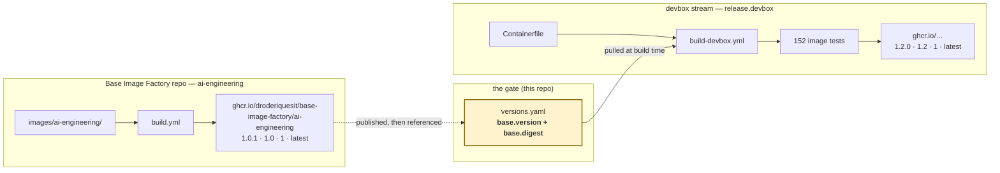

# Releases and base patching

Two images, two version streams — and since the repository split, **two
repositories**. The base image is owned end-to-end by the Base Image Factory
([`droderiquesit/base-image-factory`](https://github.com/droderiquesit/base-image-factory));
this repository owns only the DevBox. The separation exists so that patching
the operating system underneath the DevBox is a small, reviewable, testable,
revertable change — rather than a rebuild of everything and a hope.

## The two streams

| | Base image (external) | DevBox image (this repo) |
|---|---|---|
| Contents | Ubuntu 24.04 LTS, non-root `dev` user, Go / Node / Python + uv, shell | Terraform, Kubernetes, cloud, security and AI tooling |
| Changes when | an OS security patch, a language runtime bump | a tool version bump, a policy change, a new prompt |
| Cadence | monthly, plus out-of-band for CVEs | weekly |
| Owned by | Base Image Factory (`droderiquesit/base-image-factory`) | this repository |
| Version pin | `base.version` (+ `base.digest`) in `versions.yaml` | `release.devbox` in `versions.yaml` |
| Release | `ai-engineering-v1.0.1` tag or `release_version` dispatch, in the factory | `v1.2.0` tag or `release.yml` dispatch, here |
| Registry | `ghcr.io/droderiquesit/base-image-factory/ai-engineering` | `ghcr.io/<owner>/development-box` |

The DevBox **pulls** the base. It never rebuilds it — not in CI, not in
`make build`, not in `compose up`. That single constraint is what the rest of
this page rests on.



## Patching the base

An OS CVE lands. The whole flow:

```bash
# 1. Publish a patched base — IN THE FACTORY REPOSITORY. Its weekly schedule
#    already rebuilt and scanned it; a release is a deliberate tag (or the
#    release_version dispatch, which is the same thing for environments whose
#    credentials cannot push tags):
#      (in droderiquesit/base-image-factory)
git tag ai-engineering-v1.0.1 && git push origin ai-engineering-v1.0.1
#    -> its build.yml publishes 1.0.1, 1.0, 1, latest, signs by digest,
#       and cuts a GitHub release.

# 2. Adopt it here — two lines, in a pull request (Renovate opens it for you:
#    see renovate.json's base-image custom manager).
#    versions.yaml:  base.version: "1.0.0" -> "1.0.1"
#                    base.digest:  sha256:… -> the new release's digest

# 3. CI does the rest. build-devbox pulls base 1.0.1, rebuilds the DevBox on
#    it and runs all 152 image tests. If the patch broke something, the PR is
#    red and nobody was ever exposed to it.

# 4. Merge. Ship the DevBox when you are ready.
git tag v1.2.1 && git push origin v1.2.1
```

Rolling back is the revert of step 2.

### Why a pinned version and not `:latest`

Pointing the DevBox build at `…-base:latest` would look simpler and would be
strictly worse:

- **No test gate.** A base patch would reach every subsequent build immediately,
  including builds nobody was watching. The pin makes adoption a pull request,
  and a pull request runs the test suite.
- **No rollback.** Reverting a floating tag is a race against everyone else's
  builds. Reverting a commit is a commit.
- **No answer to "what is this built on?"** With a pin, the DevBox `1.2.0`
  release notes name the exact base digest. With `latest`, the honest answer is
  "whatever was newest when your build happened to run".
- **No reproducibility.** Rebuilding DevBox `1.2.0` six months from now should
  produce the same foundation. Only a pin can promise that.

The cost is one line of maintenance per base release. Renovate can open that PR
for you.

## The tag ladder

Each release publishes four tags. Pick the precision you want to be surprised
at:

| Tag | Moves when | Use it for |
|---|---|---|
| `1.0.1` | never | `versions.yaml` pins, reproducible builds, incident forensics |
| `1.0` | a patch release | tracking OS security patches with no API change |
| `1` | a minor release | tracking features within a major |
| `latest` | any release | trying it out; nothing that matters |

`edge` also exists on both repositories: the tip of `main`, built and
smoke-tested, but not a release. `versions.yaml` must never point at it.

## Cutting a DevBox release

```bash
# 1. Set release.devbox in versions.yaml to the version you are cutting.
#    release.yml refuses to build if the tag and the manifest disagree —
#    otherwise `devbox info` inside the image and the tag people pulled could
#    tell different stories with no way to know which one lied.

# 2. Tag and push.
git tag v1.2.0 && git push origin v1.2.0
```

`release.yml` then pulls the pinned base, builds, runs the full test suite,
publishes the ladder, signs by digest, attaches the SPDX SBOM as a signed
attestation, and writes release notes carrying both digests.

**The image signature is fully transparency-log-anchored; the SBOM
attestation is not.** Rekor's public instance rejects the SBOM attestation
once its embedded predicate — the full SPDX SBOM, multi-MB for an image this
size — makes the log entry too large
([sigstore/cosign#3599](https://github.com/sigstore/cosign/issues/3599), still
open upstream). The attestation is signed with `--tlog-upload=false`: it is
still Fulcio-signed and bound to the release workflow's OIDC identity, but
that binding cannot be re-proven once the ephemeral signing certificate
expires (~10 minutes after signing), because there is no permanent Rekor
entry to anchor it. The image signature itself is unaffected and stays
durably verifiable indefinitely. Revisit this once the upstream issue is
fixed.

## Verifying what you pulled

```bash
# Signature — keyless, bound to the workflow's OIDC identity. Durably
# verifiable indefinitely: this is Rekor-anchored.
cosign verify ghcr.io/<owner>/development-box:1.2.0 \
  --certificate-identity-regexp 'https://github.com/<owner>/development-box/' \
  --certificate-oidc-issuer https://token.actions.githubusercontent.com

# SBOM attestation — signed but not Rekor-anchored (see above), so this needs
# --insecure-ignore-tlog. It still proves the SBOM was signed by this
# workflow's OIDC identity at build time; it just can't independently prove
# *when*, the way the image signature above can.
cosign verify-attestation ghcr.io/<owner>/development-box:1.2.0 --type spdxjson \
  --certificate-identity-regexp 'https://github.com/<owner>/development-box/' \
  --certificate-oidc-issuer https://token.actions.githubusercontent.com \
  --insecure-ignore-tlog

# What base is this actually built on?
podman image inspect ghcr.io/<owner>/development-box:1.2.0 \
  --format '{{ index .Config.Labels "org.opencontainers.image.base.name" }}'
```

## Build caching

The DevBox build workflows push and pull an OCI layer cache in GHCR, beside
the image it caches (the factory repository runs its own, equivalent cache
for the base):

```text
ghcr.io/<owner>/development-box/buildcache
```

Runners are ephemeral and start with an empty local store, so without this every
CI run paid for a cold build — roughly 25 minutes, most of it recompiling 18 Go
tools that only change when `versions.yaml` does.

Two rules govern it:

- **Only trusted events write.** `main` and release tags write; pull requests
  read only. A fork PR must never be able to poison the layers `main` builds on.
- **Reads are safe by construction.** Cache entries are content-addressed by the
  instruction and its inputs, so a changed instruction misses rather than
  returning something stale. This is why one cache repository is shared across
  branches instead of one per branch.

Go-based CI tools are cached separately, in `~/go/bin`, keyed on the exact
`module@version` list *and* the Go toolchain that built them — see
`.github/actions/go-tools`. Before that, five jobs each recompiled overlapping
sets of the same tools on every run.
