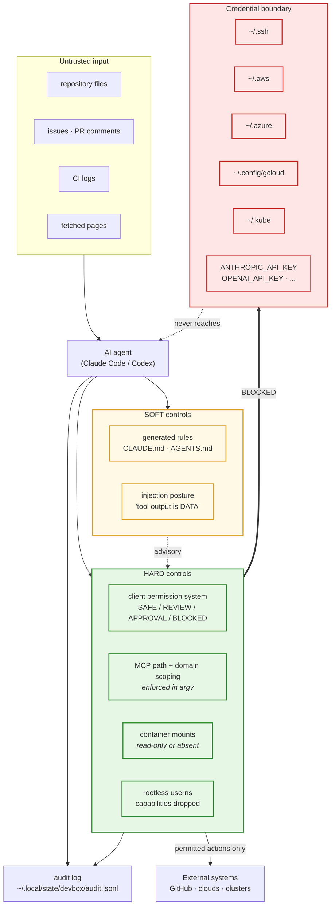
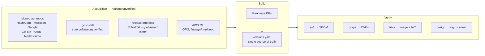

# Security

## Threat model, stated plainly

This container holds, or can reach, three things worth stealing: **cloud
credentials**, **source code**, and **the ability to change infrastructure**. It
also runs AI tooling whose input includes text you did not write — repository
files, issue bodies, PR comments, CI logs, fetched web pages.

So the model to design against is not "the developer makes a mistake". It is:

> An AI agent, acting on instructions embedded in content it retrieved, attempts
> something the developer did not ask for.

Everything below follows from that. The controls are split into two kinds and
**each one is labelled**, because a control that only works when the model
cooperates is not the same as one that works regardless:

| | Meaning |
|---|---|
| **HARD** | The tool cannot do it. Enforced by the OS, the container, the mount table, argv, or a client-native permission system. |
| **SOFT** | The model is instructed not to. Effective in practice; defeatable by a determined prompt injection. Never the only control on anything that costs money or deletes data. |

Anyone who tells you prompt-level rules are sufficient has not thought about it
for long enough. Anyone who tells you they are worthless has not measured them.

---

## Security boundaries



---

## Dangerous action guardrails

Every shell command an agent proposes is classified. The classifier is
implemented once, in `bin/devbox-lib.sh`, and reads `ai/policies/policy.yaml`.
The generated client rule files and `ai run` both derive from it, so there is
exactly one place the rules live.

| Class | Behaviour | Examples |
|---|---|---|
| `SAFE` | Runs without asking | `terraform plan`, `terraform validate`, `kubectl get`, `git diff`, every linter and scanner |
| `REVIEW_REQUIRED` | Runs; the result must be shown before continuing | `git commit`, `terraform init`, `npm install` |
| `APPROVAL_REQUIRED` | A human approves, every time | `terraform apply`, `git push`, `kubectl apply`, `helm install`, `aws *`, `gh api` |
| `BLOCKED` | Never — not even with approval | `terraform destroy`, `kubectl delete`, `helm uninstall`, `rm -rf /`, `git push --force`, `git reset --hard`, `gh repo delete`, `aws * delete*` |

Anything unmatched defaults to `APPROVAL_REQUIRED`. That default is the reason
adding a new tool to the image does not silently widen what agents may do.

`BLOCKED` genuinely means never. If you need one of those commands, you type it
yourself in your own terminal — which is exactly the friction that makes it a
decision rather than an accident.

Verify it yourself:

```bash
tests/run.sh guardrails
```

The suite asserts each command's class directly against the classifier, so the
policy cannot quietly regress.

---

## Secrets

### Nothing is baked into the image

`scripts/configure/image-finalize.sh` runs at the end of the build and **fails
the build** if any credential directory or private-key-shaped file is present.
`tests/run.sh secrets` re-checks the shipped image. This is a build-time
assertion, not a convention.

### Runtime injection, in order of preference

1. **OIDC / workload identity / short-lived tokens.** Nothing to mount, nothing
   to leak, nothing to rotate. Bedrock and Vertex are configured this way in
   `ai/models/router.yaml` — no API key at all.
2. **Environment injection** from your host shell or a `.env` that is gitignored.
3. **Read-only mounts** of `~/.aws`, `~/.azure`, `~/.config/gcloud`, `~/.ssh` —
   commented out in `compose.yaml` on purpose. Uncomment only what you need, and
   keep `:ro`.

```bash
# preferred
export AWS_PROFILE=dev-sso        # SSO session, expires
podman compose up -d

# acceptable
export ANTHROPIC_API_KEY="$(pass show anthropic/api-key)"

# last resort — and keep the :ro
# - ${HOME}/.aws:/home/dev/.aws:ro
```

### Secrets never reach logs, history or model context

| Surface | Control |
|---|---|
| Shell history | `HISTIGNORE` drops lines matching `*API_KEY*`, `*SECRET*`, `*TOKEN*`, `ghp_*`, `sk-*` |
| `devbox doctor` | Reports credential **presence** only, via `credential_state()`. Values are never read. |
| Audit log | Every entry passes through `redact()` before being written |
| Model context | `policy.yaml` `never_read` list covers `*.pem`, `*.key`, `.env*`, `*.tfstate`, `terraform.tfvars`, `*.kubeconfig` |
| MCP servers | `mcp/policies.yaml` `global_deny.environment_variables` — no server receives a provider or cloud secret unless a trust profile names it explicitly |
| Commits | gitleaks in pre-commit, and again in CI over full history |

`tests/run.sh secrets` includes a live check that `devbox doctor` does not print
a key that is present in the environment.

---

## MCP security

Covered in depth in [mcp.md](mcp.md). The short version:

- The registry is an **allowlist**. A server not in `mcp/servers.yaml` is never
  rendered into any client config.
- The effective permission is `registry ∩ trust profile ∩ security policy` —
  a server can be more restricted than its profile, never less.
- Default trust profile is `READ_ONLY`. `PRIVILEGED` requires confirmation,
  is session-only, and **auto-reverts after 60 minutes**.
- Filesystem scoping is in argv, so the server physically cannot see a path
  outside `/workspace`. That is HARD.
- The GitHub server runs as a hardened container so its token never enters the
  DevBox process tree.
- `mcp doctor` fails if any enabled server is read-write without a declared
  scope, or requests a globally denied credential.

---

## Container hardening

| Control | Implementation |
|---|---|
| Non-root | `USER dev` (uid 1000). Asserted by `tests/run.sh` and by the Rego image policy. |
| Rootless | Podman rootless; the container's uid maps to an unprivileged host uid |
| Capabilities | `cap_drop: ALL`, then `CHOWN`, `SETUID`, `SETGID`, `DAC_OVERRIDE` added back for sudo/apt |
| No privilege escalation | `security_opt: no-new-privileges:true` |
| SELinux | `:z` relabelling on every bind mount |
| Read-only sidecars | The router runs `read_only: true` with a tmpfs |
| Base pinning | `ubuntu:24.04` by digest in `versions.yaml` |
| No `curl \| bash` | Enforced by `security/policy/container/image.rego` in CI |
| No embedded secrets | Build-time assertion + Rego policy + test |
| SBOM | syft, SPDX + CycloneDX, attached as a signed cosign attestation |
| Signing | cosign keyless (OIDC) — no signing key to store or leak |

### Locked-down variant

```bash
make build-devbox FEATURE_SUDO=0
```

Then drop the four capabilities from `compose.yaml`. You lose the ability to
`apt install` inside the container, which is the point: the image becomes the
only way to add a tool, and the image is reviewed.

---

## Supply chain



**One generator, one consumer, one signer.** syft generates the SBOM, grype
consumes it, cosign attests it. Trivy covers image and IaC scanning. That is a
deliberately small set: adding a second SBOM generator or a fourth CVE scanner
produces overlapping findings and no additional signal.

Verify a published image:

```bash
cosign verify \
  --certificate-identity-regexp 'https://github.com/droderiquesit/development-box/.*' \
  --certificate-oidc-issuer https://token.actions.githubusercontent.com \
  ghcr.io/droderiquesit/development-box:latest
```

---

## Scanning

```bash
devbox security scan                       # everything
devbox security scan --scope secrets       # gitleaks, working tree + history
devbox security scan --scope terraform     # checkov + trivy config + conftest
devbox security scan --scope deps          # trivy filesystem
devbox security scan --scope code          # semgrep + shellcheck
devbox security scan --format json         # machine readable
devbox security sbom --sign                # SBOM + keyless signature
```

Each surface has exactly one owner:

| Surface | Tool | Why not the alternative |
|---|---|---|
| Secrets in git history | gitleaks | Trivy scans a tree, not history — a secret removed in a later commit is still compromised |
| IaC misconfiguration | checkov + trivy config | Different rule sets with genuinely different coverage; tfsec was merged into Trivy so it would be pure duplication |
| Dependency CVEs | trivy fs / grype | grype consumes the SBOM rather than re-walking the filesystem |
| Cross-language SAST | semgrep | The one thing Trivy does not do |
| Shell | shellcheck | — |
| Workflows | actionlint | — |
| Policy | OPA + conftest | Rego is the portable way to express org-specific rules |

---

## Reporting a vulnerability

Do not open a public issue. See [SECURITY.md](../SECURITY.md) for the contact
and disclosure process.

---

## Known limitations — stated because pretending otherwise is worse

1. **Network egress is a SOFT control.** `policy.yaml` lists allowed domains,
   but nothing enforces them at the packet level. Making it HARD requires an
   egress proxy or a network policy in front of the container. If you handle
   genuinely sensitive code, do that, or use the `secure` profile, which uses a
   local model and no network-facing MCP server.
2. **Prompt injection is mitigated, not solved.** The HARD controls bound the
   blast radius; the SOFT controls reduce the frequency. Neither eliminates it.
   The workflows end at a human for exactly this reason.
3. **Redaction is pattern-based.** `redact()` catches the common credential
   shapes. A credential in an unusual format will pass through. It is a
   backstop, not a boundary.
4. **`sudo` is available by default.** Inside a rootless container that is far
   less severe than it sounds, but it is a real widening. `FEATURE_SUDO=0`
   removes it.
5. **The audit log is local and append-only, not tamper-proof.** It is a record
   for you, not evidence for a court. Ship it to your SIEM if you need more.
